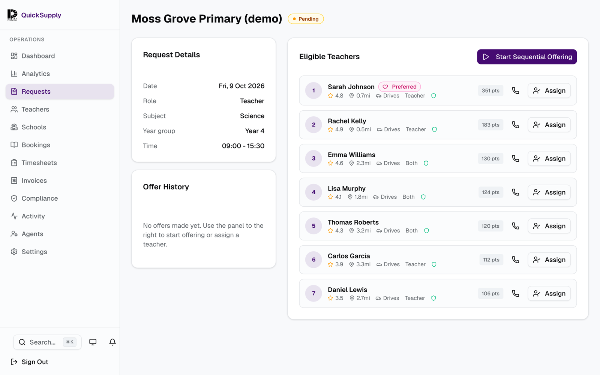
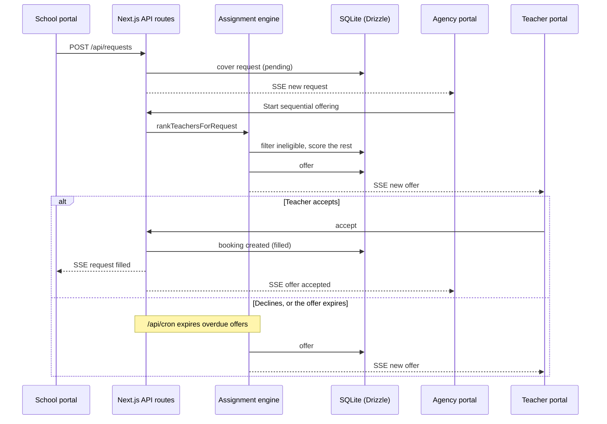

# QuickSupply: same-day supply cover booking

A booking workflow for schools, supply agencies and supply teachers: a school's cover request is checked against hard eligibility rules, offered to one ranked teacher at a time, and every party sees the same live status until it is filled.

[](https://github.com/MatthewPaver/QuickSupply/actions/workflows/ci.yml)
[](LICENSE)



*Agency view of a seeded request. Only teachers who passed every eligibility rule appear; the points come from the weights in [`src/lib/scoring.ts`](src/lib/scoring.ts). All schools, people and contacts are fictional.*

**No setup needed:** [watch the booking walkthrough](https://matthewpaver.github.io/preview.html?app=quicksupply), which follows one request through the school, agency and teacher views.

## The problem

A Liverpool supply-teacher booking process I observed relied on dated screens, phone calls and messages. When a teacher is off sick at 7am, the school needs to know who is coming, the agency needs to know who has been asked, and the teacher needs one clear offer with a deadline. When the status lives in someone's inbox, two teachers can both think they have the job, or nobody is asked at all.

QuickSupply asks whether that handoff can be made explicit and testable:

1. A school creates a cover request.
2. The engine drops anyone who is not eligible, then ranks the rest.
3. One timed offer goes out at a time; a decline or timeout moves to the next teacher.
4. The agency can override, withdraw or cancel at any point.
5. School, agency and teacher portals update live from the same state.

This is a working case study with fictional data, not a live service. [`CASE_STUDY.md`](CASE_STUDY.md) covers what it does and does not prove.

## Quickstart

Needs Node 22 (`.nvmrc`) and Corepack, which ships with Node and runs the pinned pnpm 10.

```bash
corepack pnpm install --frozen-lockfile
export DATABASE_URL=./quicksupply-demo.db DEMO_MODE=true NEXT_PUBLIC_DEMO_MODE=true
corepack pnpm db:migrate && corepack pnpm db:seed
corepack pnpm dev
```

The seed should end with:

```text
Seed complete!
  5 schools, 12 teachers, 3 agents, 8 requests, 2 bookings
```

Open <http://localhost:3000/login> and pick any demo account: a school, a teacher or the agency. Use a fresh `DATABASE_URL`, because the seed replaces what is there. Both demo flags must be on for one-click sign-in; otherwise the demo-session endpoint refuses without setting a cookie, and you sign in with the public demo password `Password1!` (for example `mersey-view@schools.quicksupply.example`).

## How it works



- **Assignment engine** ([`src/lib/assignment-engine.ts`](src/lib/assignment-engine.ts)): ranking, sequential offers, decline and timeout handling, manual assignment, withdrawal and cancellation. It drops anyone who fails role, compliance, double-booking, school blacklist, previous decline, emergency, night-before-contact, availability or travel-distance rules before scoring.
- **Scoring** ([`src/lib/scoring.ts`](src/lib/scoring.ts)): a pure function over preferred teacher, agency rating, school reviews, distance, driving, previous work at the school and subject match. The agency can change the weights in Settings.
- **Live status** ([`src/lib/sse-manager.ts`](src/lib/sse-manager.ts)): in-process Server-Sent Events channels for `agency`, `teacher:{id}` and `school:{id}`.
- **Maintenance** ([`src/app/api/cron/route.ts`](src/app/api/cron/route.ts)): expires overdue offers and advances the queue, expires compliance documents and prunes old tokens and notifications. Protected by `CRON_SECRET` outside development.
- **Three portals** (`src/app/school`, `src/app/teacher`, `src/app/agency`): signed session cookies (`src/lib/auth.ts`) with a role per portal. Schools request and track cover, teachers manage availability and answer offers, and the agency coordinates.
- **Data** (`src/lib/db/schema.ts`, `drizzle/`): SQLite through Drizzle ORM with versioned migrations and a fictional Liverpool seed (`scripts/seed.ts`).

## Results

What the tests check, with the commands that reproduce them:

| Check | Command | Result | Runs in CI |
| --- | --- | --- | --- |
| Unit and integration tests | `corepack pnpm test` | 45 tests in 9 files pass: scoring weights, eligibility (a preferred teacher cannot bypass a date block), demo sign-in gating, upload file-type checks, seed safety, patched dependency versions | Yes |
| Route smoke test | `corepack pnpm e2e:routes` (app on port 3000) | 19 public, school, teacher and agency screens return 200 | Yes |
| Full booking journey | `corepack pnpm exec playwright test e2e/full-demo-flow.spec.ts` | School creates a request, agency assigns it through the visible controls, teacher accepts, school sees it filled | Yes |
| Whole browser suite | `corepack pnpm e2e` | 42 Playwright tests in 13 specs pass, against a throwaway seeded database on port 3200 | Only the journey and offline specs |
| Lint and types | `corepack pnpm lint`, `corepack pnpm exec tsc --noEmit` | Clean (lint reports 10 `set-state-in-effect` warnings) | Yes |

What they do not show: that the workflow is faster than phone calls for real schools, how the ranking behaves on real teacher pools, or how the app behaves under load. Most of the 11 non-journey Playwright specs check that a page loads and its key controls are present; they do not exercise each feature end to end.

## Design decisions and trade-offs

- **Sequential offers, not broadcast.** Offering a job to everyone at once fills faster but creates several apparent winners and a round of "sorry, it's gone" messages. One offer at a time means one answer per teacher. The cost is speed, so the response window is short: 7 minutes by default for emergency requests and 60 otherwise, both configurable by the agency.
- **Eligibility before preference.** A single blended score would let a large "preferred teacher" bonus (200 points by default) outweigh being unavailable or too far away. Hard rules run first and only eligible teachers are scored, so preference can reorder the shortlist but never put an ineligible person on it. The cost: a near miss is invisible rather than ranked low.
- **Inspectable weights, not a learned or AI score.** Each ranked teacher shows a points total from seven named weights the agency can change. A model trained on booking outcomes might rank better, but there is no outcome data to train it on and a coordinator could not explain its choices to a school. The cost is that the weights are judgement, not evidence.
- **The human can always override.** The agency can assign any teacher on the shortlist directly, withdraw an offer or cancel a booking. Staffing exceptions such as safeguarding concerns or a school's last-minute change need an accountable person, and full automation would hide them.
- **In-process SSE rather than WebSockets or a message broker.** Status flows one way, from server to portals, so SSE is enough and needs no extra infrastructure. The cost is that channels live in one Node process; running several instances would need a shared broker such as Redis pub/sub.

## Limits and non-goals

- **Not validated with users.** It shows that the workflow can be built and explained. It does not show demand, procurement fit, safeguarding acceptance or that schools would switch supplier. [`CASE_STUDY.md`](CASE_STUDY.md) sets out the validation steps that should come before more features.
- **Fictional data only.** Seeded passwords are public. Do not deploy it for real schools or teachers without a separate security review, `DEMO_MODE=false`, a rebuild with `NEXT_PUBLIC_DEMO_MODE=false`, and real values for `SESSION_SECRET`, `CRON_SECRET`, `RESEND_API_KEY`, `FROM_EMAIL`, `NEXT_PUBLIC_APP_URL` and the Upstash rate-limit keys. The seed refuses `NODE_ENV=production` unless `SEED_ALLOW_PRODUCTION=1`.
- **Offer expiry needs a trigger.** Overdue offers advance only when `/api/cron` is called. In development the agency request page calls it while an offer is active; in production a scheduler must call it with `CRON_SECRET`. The included `Run maintenance hook` workflow is manual-only.
- **Single instance, SQLite.** SSE channels are in memory and the database is a local SQLite file. The `postgres` package is installed, but there is no Postgres adapter yet.
- **Ranking inputs are simplified.** Distance is straight-line (haversine), not travel time, and teachers with no recorded availability count as available.
- **Market context is context only.** `corepack pnpm data:dfe` builds [`data/market-context/dfe-teacher-vacancies.json`](data/market-context/dfe-teacher-vacancies.json) from the DfE teacher-vacancies statistics (Liverpool, North West and England aggregates). It never feeds eligibility or ranking, and annual vacancies are not a proxy for supply-cover bookings.
- `src/lib/operations-agents.ts` holds deterministic reviewers (thin shortlists, compliance expiry, disputed timesheets) that are unit-tested but not yet wired into the UI.

## Repository layout and tests

```text
src/app/            Next.js App Router: school/, teacher/, agency/ portals and api/ routes
src/lib/            assignment engine, scoring, eligibility, SSE, auth, notifications (+ *.test.ts)
src/components/     portal UI (shadcn/ui on Tailwind CSS v4)
drizzle/            SQL migrations
scripts/            seed, reset, route smoke test, DfE data fetch
e2e/                Playwright specs (full-demo-flow is the end-to-end journey)
docs/               booking and offer state logic, README screenshot
```

```bash
corepack pnpm lint && corepack pnpm exec tsc --noEmit && corepack pnpm test
corepack pnpm exec playwright install chromium
corepack pnpm e2e        # builds and serves on port 3200 with a throwaway database
```

`docs/BOOKING_AND_OFFER_LOGIC.md` describes the request, offer and booking states in detail. CI (`.github/workflows/ci.yml`) runs lint, types, unit tests, the build, the route smoke test and the full booking journey on every push; CodeQL runs separately.

## Licence

MIT. See [LICENSE](LICENSE). The Desian Education name and logo are illustrative product assets and are not covered by the code licence.
